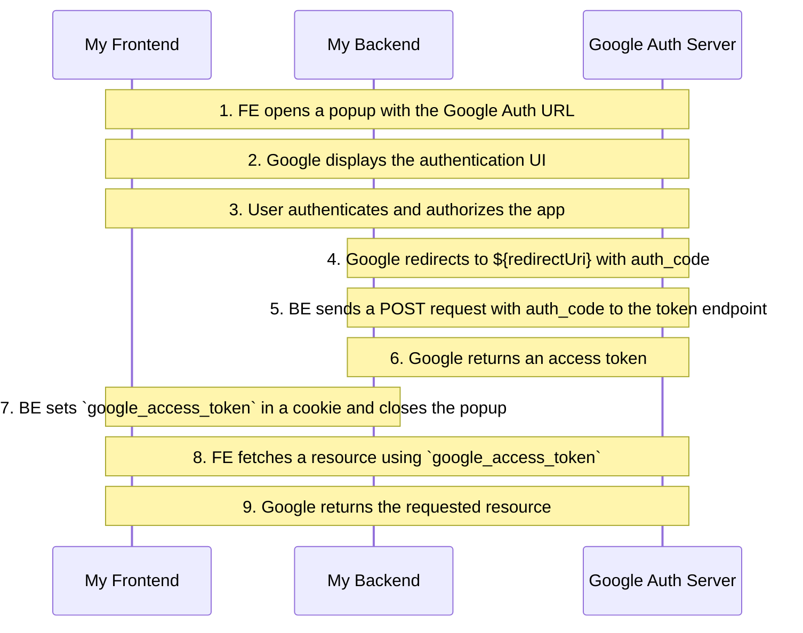

# OAuth 2.0 Demo Project

This project showcases how to:
1. Authorize via OAuth 2.0
2. Fetch resource with the access_token

---

## Oauth2 details
- ClientID: `918991060620-npqd3dqpokv9t33seva3c6k09p6pa5pq.apps.googleusercontent.com`
- ClientSecret: `GOCSPX...`
- redirectUri: `http://localhost:8080/callback`

You can edit these details in [Google Console](https://console.cloud.google.com/apis/credentials?invt=Abt9Mw&project=oauth2-demo-455916)

---

## Flow 
1. Frontend opens a popup with the URL:
```
GET https://accounts.google.com/o/oauth2/v2/auth?
response_type=code
&client_id=${clientId}
&redirect_uri=${redirectUri}
&scope=${scope}
```
2. The OAuth 2.0 Website from Google opens
3. User authenticates and authorizes the app
4. Gets redirected to a backend to the ${redirectUri} with auth_code
5. BE sends a POST to token endpoint
```
POST https://www.googleapis.com/oauth2/v4/token?
client_id=${google.client.id}
&client_secret=${google.client.secret}
&redirect_uri=${authorization.redirect.uri}
&grant_type=authorization_code
&code=${code}
```
6. BE gets access_token as response
7. BE sets `google_access_token` via cookie and closes the popup:
```
<script>
   window.close()
</script>
```
8. FE fetches resource (`https://www.googleapis.com/oauth2/v1/userinfo`) with OAuth 2.0 `google_access_token`
9. Resource is returned

---

## Sequence Diagram



---

## Additional Resources:
- [OAuth2 Specification](https://datatracker.ietf.org/doc/html/rfc6749)
- [Oauth 2.0 Video from Octa](https://www.youtube.com/watch?v=996OiexHze0)